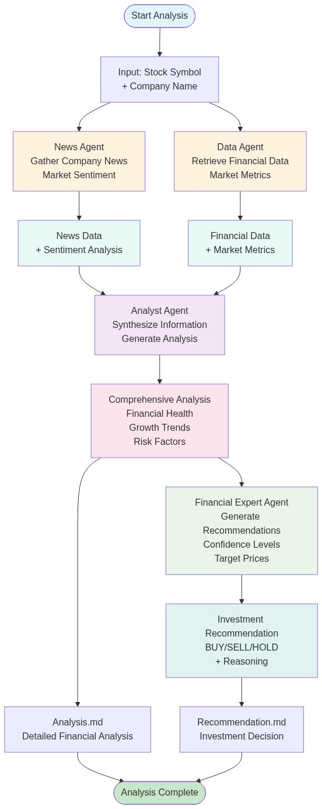
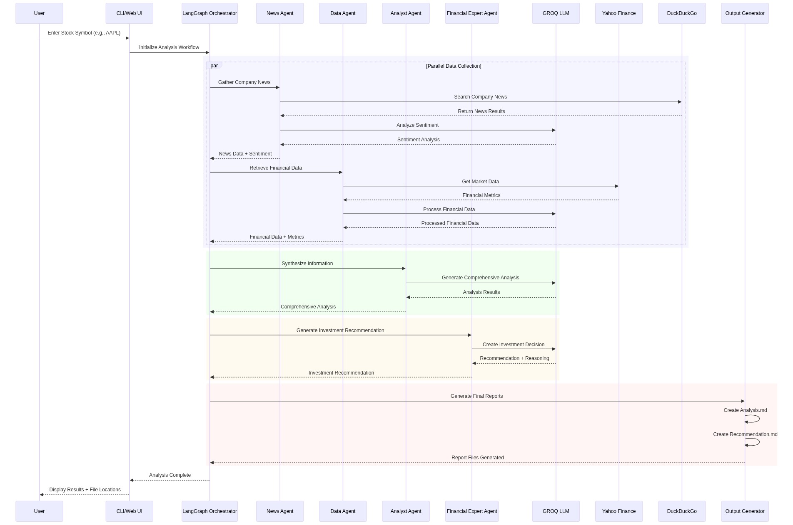
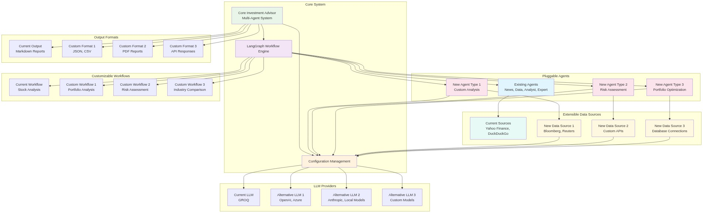
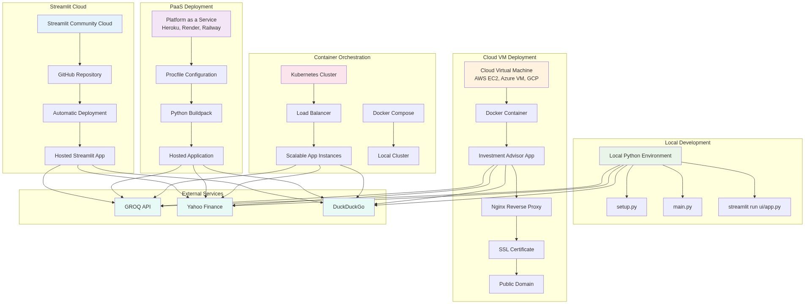

# Technical and Design Document: Investment Advisor Multi-Agent System

## Abstract

The Investment Advisor Multi-Agent System is a sophisticated, production-ready AI-powered investment advisory platform that leverages multiple specialized agents orchestrated through LangGraph to provide comprehensive stock analysis and investment recommendations. The system integrates GROQ for large language model (LLM) inference, Yahoo Finance for financial data retrieval, DuckDuckGo for news aggregation, and a modular agent architecture for scalable, intelligent investment decision support. The platform supports both a modern Streamlit web interface and a comprehensive command-line interface (CLI), enabling flexible, secure, and extensible investment analysis workflows.

## 1. Introduction and Motivation

The complexity of modern financial markets and the need for data-driven investment decisions has created a demand for intelligent systems that can analyze vast amounts of financial data, news, and market information. The Investment Advisor Multi-Agent System addresses this by combining specialized AI agents with advanced LLM capabilities, providing both individual investors and financial professionals with powerful tools for comprehensive stock analysis, risk assessment, and investment recommendations.

## 2. System Architecture

### 2.1 High-Level Overview

The Investment Advisor system is organized into five main architectural layers:

- **User Interface Layer**: Dual interface—Streamlit web UI and CLI—for all investment analysis operations
- **Application Layer**: Core orchestration engine with LangGraph workflow management and agent coordination
- **Agent Layer**: Specialized AI agents for news analysis, financial data processing, market analysis, and investment recommendations
- **External Services**: LLM (GROQ), financial data (Yahoo Finance), and news search (DuckDuckGo) integrations
- **Data Storage**: File system organization for analysis outputs, recommendations, logs, and configuration


*Figure 1: High-level system architecture showing all major components and their relationships*

### 2.2 Component Architecture

The system employs a multi-agent architecture where each agent specializes in specific aspects of investment analysis:

- **News Agent**: Gathers and analyzes company-related news, press releases, and market sentiment
- **Data Agent**: Retrieves and processes financial statements, market data, and performance metrics
- **Analyst Agent**: Synthesizes information into comprehensive financial and contextual analysis
- **Financial Expert Agent**: Generates investment recommendations with confidence levels and target prices

### 2.3 LangGraph Workflow Orchestration

The system uses LangGraph to orchestrate agent interactions through a directed graph workflow:



*Figure 2: LangGraph workflow orchestration showing agent interaction sequence and data flow*

The workflow follows this pattern:
```
News Agent → Data Agent → Analyst Agent → Financial Expert Agent
     ↓           ↓           ↓              ↓
  News Data → Financial → Analysis → Recommendation
```

## 3. Key Modules and Their Roles

### 3.1 Core System Components

- **main.py**: CLI entry point; orchestrates investment analysis workflows
- **ui/app.py**: Streamlit web interface; provides interactive investment analysis dashboard
- **graphs/investment_graph.py**: LangGraph workflow definition and agent orchestration
- **graphs/execution.py**: Workflow execution engine and output generation
- **setup.py**: Environment setup, dependency management, and system validation

### 3.2 Agent Modules

- **agents/news_agent.py**: News gathering and sentiment analysis using DuckDuckGo search
- **agents/data_agent.py**: Financial data retrieval and processing using Yahoo Finance
- **agents/analyst_agent.py**: Information synthesis and comprehensive analysis generation
- **agents/financial_expert_agent.py**: Investment recommendation generation with risk assessment

### 3.3 Tool and Utility Modules

- **tools/search_tool.py**: DuckDuckGo search integration for news and company information
- **config/settings.py**: Global configuration management for API keys, models, and system parameters
- **config/logging_config.py**: Centralized logging configuration and management

## 4. Data Flow and Processing Pipeline



*Figure 3: Data flow sequence showing the end-to-end process from user input to final output generation*

### 4.1 Investment Analysis Workflow

1. **Input Processing**: Stock symbol and optional company name validation
2. **News Gathering**: Parallel news search and sentiment analysis
3. **Financial Data Retrieval**: Market data, financial statements, and performance metrics
4. **Information Synthesis**: Multi-agent collaboration for comprehensive analysis
5. **Recommendation Generation**: Investment decision with confidence and reasoning
6. **Output Generation**: Structured Markdown reports and summary data

### 4.2 Agent Communication Protocol

Agents communicate through structured data exchange:
- **Input**: Stock symbol, company context, and analysis parameters
- **Processing**: Sequential agent execution with data passing
- **Output**: Structured analysis results and investment recommendations

## 5. Security and Configuration

### 5.1 Secrets Management

- **API Key Security**: All API keys (GROQ_API_KEY) are loaded from a `.env` file
- **Environment Isolation**: Configuration separation between development and production
- **Best Practices**: `.env` is git-ignored; `.env.example` is provided for onboarding

### 5.2 Configuration Management

- **Centralized Settings**: All system parameters managed through `config/settings.py`
- **Environment Variables**: Flexible configuration via `.env` file overrides
- **Model Configuration**: Configurable LLM models, temperature, and API endpoints

## 6. Extensibility and Customization



*Figure 4: Extensibility diagram showing pluggable components and configuration-driven architecture*

### 6.1 Pluggable Architecture

- **Agent Extensibility**: Easy addition of new specialized agents
- **LLM Agnostic**: Switch between different LLM providers via configuration
- **Data Source Integration**: Extensible financial data and news sources
- **Workflow Customization**: Configurable LangGraph workflows for different analysis types

### 6.2 Customization Options

- **Analysis Depth**: Configurable analysis granularity and detail levels
- **Output Formats**: Extensible output formats beyond Markdown
- **Risk Models**: Customizable risk assessment and scoring algorithms
- **Industry Specialization**: Domain-specific analysis modules

## 7. CLI and Web UI Design

### 7.1 Command-Line Interface

- **Primary Commands**: `analyze`, `status`, `help`
- **Interactive Mode**: Conversational interface with command shortcuts
- **Rich Output**: Formatted analysis results and progress indicators
- **Error Handling**: Comprehensive error messages and recovery suggestions

### 7.2 Streamlit Web Interface

- **Dashboard**: Real-time investment analysis overview
- **Analysis Form**: Stock symbol input and analysis parameters
- **Results Display**: Interactive analysis results and recommendations
- **Settings Management**: Configuration and API key management

## 8. Logging, Monitoring, and Testing

### 8.1 Logging System

- **Structured Logging**: Timestamped log files with configurable levels
- **Dual Output**: Console output for user feedback, file logging for debugging
- **Session Management**: Per-session log files with rotation
- **Error Tracking**: Comprehensive error logging and stack traces

### 8.2 Testing and Validation

- **Component Testing**: Individual agent and module testing
- **Integration Testing**: End-to-end workflow validation
- **Performance Testing**: Response time and resource usage monitoring
- **Setup Validation**: Automated environment and dependency verification

## 9. Supported Formats and Deployment

### 9.1 Data Formats

- **Input**: Stock symbols, company names, analysis parameters
- **Output**: Markdown reports, structured data, log files
- **Configuration**: Environment variables, Python configuration files
- **Logs**: Timestamped log files with configurable formats

### 9.2 Deployment Options



*Figure 5: Deployment architecture showing various hosting and scaling options*

- **Local Development**: Python environment with dependency management
- **Web Deployment**: Streamlit Cloud, Heroku, or custom hosting
- **Container Deployment**: Docker support for consistent environments
- **Cross-Platform**: Windows, Linux, and macOS compatibility

## 10. Performance and Scalability

### 10.1 Performance Characteristics

- **Response Time**: Typical analysis completion in 30-60 seconds
- **Concurrent Processing**: Parallel agent execution for improved performance
- **Resource Usage**: Optimized memory and CPU utilization
- **API Rate Limiting**: Intelligent handling of external API constraints

### 10.2 Scalability Considerations

- **Agent Scaling**: Horizontal scaling of individual agent instances
- **Workflow Optimization**: Configurable workflow complexity and depth
- **Caching**: Intelligent caching of frequently accessed data
- **Load Balancing**: Distribution of analysis requests across multiple instances

## 11. Error Handling and Resilience

### 11.1 Error Management

- **Graceful Degradation**: System continues operation with partial failures
- **Retry Mechanisms**: Automatic retry for transient API failures
- **Fallback Strategies**: Alternative data sources and analysis methods
- **User Communication**: Clear error messages and recovery instructions

### 11.2 Resilience Features

- **API Failure Handling**: Robust handling of external service outages
- **Data Validation**: Input validation and sanitization
- **State Management**: Consistent system state across failures
- **Recovery Procedures**: Automated recovery and manual intervention options

## 12. References and Future Work

### 12.1 System Diagrams

The technical design document includes several comprehensive diagrams that illustrate the system architecture and workflows:

- **Figure 1**: System Architecture - High-level system architecture showing all major components and their relationships
- **Figure 2**: LangGraph Workflow - Workflow orchestration showing agent interaction sequence and data flow  
- **Figure 3**: Data Flow Sequence - End-to-end process from user input to final output generation
- **Figure 4**: Extensibility Architecture - Pluggable components and configuration-driven architecture
- **Figure 5**: Deployment Architecture - Various hosting and scaling options

All diagrams are available in the `docs/diagrams/` directory and use Mermaid syntax for easy maintenance and version control. For detailed diagram descriptions and usage instructions, see `docs/diagrams/README.md`.

### 12.2 Technical References

- **LangGraph**: https://github.com/langchain-ai/langgraph
- **GROQ**: https://groq.com/
- **Yahoo Finance**: https://finance.yahoo.com/
- **DuckDuckGo**: https://duckduckgo.com/
- **Streamlit**: https://streamlit.io/

### 12.3 Future Enhancements

- **Advanced Analytics**: Machine learning models for pattern recognition
- **Portfolio Management**: Multi-stock analysis and portfolio optimization
- **Real-time Updates**: Live market data integration and alerts
- **Mobile Applications**: Native mobile apps for iOS and Android
- **API Services**: RESTful API for third-party integrations
- **Advanced Visualization**: Interactive charts and financial dashboards
- **Risk Modeling**: Sophisticated risk assessment and portfolio stress testing
- **Compliance Features**: Regulatory compliance and audit trail management

### 12.4 Sample Output

The system generates comprehensive analysis and recommendation reports. Below are sample outputs from a recent AAPL (Apple Inc.) analysis:

#### Sample Analysis Output (AAPL_Analysis.md)

```markdown
# Investment Analysis Report: AAPL
Generated on: 2025-08-28 22:21:00

## Company Information
- **Company Name**: Apple Inc.
- **Sector**: Technology
- **Industry**: Consumer Electronics
- **Country**: United States

## Current Market Data
- **Current Price**: $232.56
- **Market Cap**: $3,451,283,308,544
- **Volume**: 37,892,960

## News and Market Sentiment
- **Market Sentiment**: Positive
- **Key Developments**:
  - Yahoo! Finance Apple Inc. (AAPL) Stock Price, News, Quote & History
  - CNBC AAPL: Apple Inc - Stock Price, Quote and News
  - Nasdaq Apple (AAPL) Stock Price, News, Quotes, & Historic Data

## Financial Analysis
- **Financial Health**: Moderate - Limited data available
- **Growth Trends**: Stable - Insufficient data for trend analysis
- **Key Metrics**:
  - Revenue: $365.7 billion (2022)
  - Net Income: $94.7 billion (2022)
  - Cash and Cash Equivalents: $193.6 billion (2022)

## Comprehensive Analysis
### Executive Summary
Apple Inc. (AAPL) is a leading technology company in the consumer electronics sector. Our analysis suggests that AAPL's stock price has been positively impacted by recent rumors about the new iPhone 17, indicating a potential innovative product launch. However, limited financial data and insufficient growth trend analysis hinder a comprehensive assessment of the company's financial health and growth prospects.

### Key Insights
- Strong market position in consumer electronics
- Stable growth trends despite limited data availability
- Positive market sentiment driven by product innovation rumors
- Moderate financial health with strong cash position
- Intense competition in the technology sector

### Risk Assessment
- **Competition**: AAPL faces intense competition in the consumer electronics sector
- **Market volatility**: Stock price sensitivity to market fluctuations
- **Supply chain disruptions**: Potential impact on production and revenue
- **Regulatory risks**: Changes in regulations affecting business model
```

#### Sample Recommendation Output (AAPL_Recommendation.md)

```markdown
# Investment Recommendation: AAPL
Generated on: 2025-08-28 22:21:00

## Investment Recommendation
**RECOMMENDATION**: BUY
**Confidence Level**: Medium (60%)
**Target Price**: $245-$255
**Time Horizon**: Short-term (3-6 months)

## Reasoning
The recommendation to BUY Apple Inc. (AAPL) is based on the following key factors:

- Positive news sentiment, indicating a strong brand reputation and customer loyalty
- Stable growth trends, despite limited data availability, suggesting a consistent business model
- Moderate financial health, with a large market capitalization and well-established cash reserve
- Diversified product portfolio providing stable revenue streams

## Risk Assessment
Primary risks include:
- Intensifying competition from rival technology companies
- Potential supply chain and manufacturing disruptions
- Regulatory challenges and government policy changes

Risk mitigation strategies:
- Portfolio diversification to reduce technology sector exposure
- Continuous monitoring of news and financial data
- Adjustable investment time horizons for market volatility

## Investment Strategy
- **Entry Points**: Buy at current price ($232.56) or during market dips
- **Exit Points**: Sell when target price range ($245-$255) is reached
- **Position Sizing**: Allocate 5-10% of portfolio to AAPL
- **Portfolio Fit**: Suitable for diversified portfolios as a large-cap technology stock

## Monitoring Points
Key metrics to watch:
- Market share maintenance in competitive landscape
- Supply chain stability and manufacturing operations
- Regulatory environment changes
- Revenue growth and financial performance trends
```

---

*For implementation details, see the codebase and README. For deployment, see the Streamlit hosting guide in `docs/`.*
