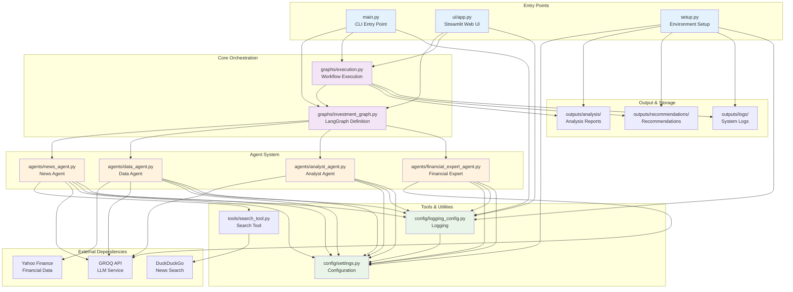

# Component Relationships and Dependencies Diagram

## Component Dependencies

### Entry Points
- **main.py**: Primary CLI interface, depends on orchestration and execution modules
- **ui/app.py**: Web interface, depends on orchestration and execution modules
- **setup.py**: Environment setup, depends on configuration and output directories

### Core Orchestration
- **investment_graph.py**: Defines LangGraph workflow and agent interactions
- **execution.py**: Executes workflow and manages output generation

### Agent System
- **news_agent.py**: News gathering and sentiment analysis
- **data_agent.py**: Financial data retrieval and processing
- **analyst_agent.py**: Information synthesis and analysis
- **financial_expert_agent.py**: Investment recommendations

### Tools & Utilities
- **search_tool.py**: DuckDuckGo search integration
- **settings.py**: Centralized configuration management
- **logging_config.py**: Logging setup and management

### External Dependencies
- **GROQ API**: Large Language Model service
- **Yahoo Finance**: Financial data provider
- **DuckDuckGo**: News search service

### Output & Storage
- **analysis/**: Generated analysis reports
- **recommendations/**: Investment recommendations
- **logs/**: System execution logs

## Key Relationships

- **Configuration Centralization**: All agents depend on centralized settings
- **Logging Integration**: All components use centralized logging system
- **LLM Integration**: Multiple agents use GROQ for AI processing
- **Data Flow**: Clear dependency chain from input to output generation
