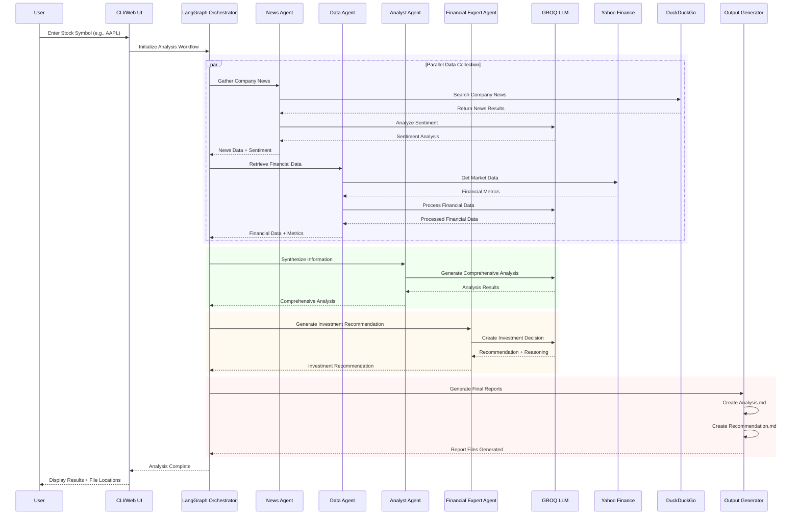

# Data Flow Sequence Diagram

## Sequence Description

### 1. User Input Phase
- User provides stock symbol through CLI or Web UI
- System initializes LangGraph workflow orchestration

### 2. Parallel Data Collection
- **News Agent**: Searches DuckDuckGo for company news and analyzes sentiment using GROQ
- **Data Agent**: Retrieves financial data from Yahoo Finance and processes it using GROQ

### 3. Information Synthesis
- **Analyst Agent**: Combines news and financial data to generate comprehensive analysis
- Uses GROQ LLM for intelligent information synthesis

### 4. Recommendation Generation
- **Financial Expert Agent**: Processes analysis to create investment recommendations
- Generates confidence levels, target prices, and reasoning

### 5. Output Generation
- Creates structured Markdown reports (Analysis.md, Recommendation.md)
- Returns results to user interface

## Key Benefits

- **Parallel Processing**: News and financial data collection happen simultaneously
- **LLM Integration**: GROQ LLM used at multiple stages for intelligent processing
- **Structured Workflow**: Clear sequence of operations with defined inputs/outputs
- **Error Handling**: Each stage can handle failures gracefully
