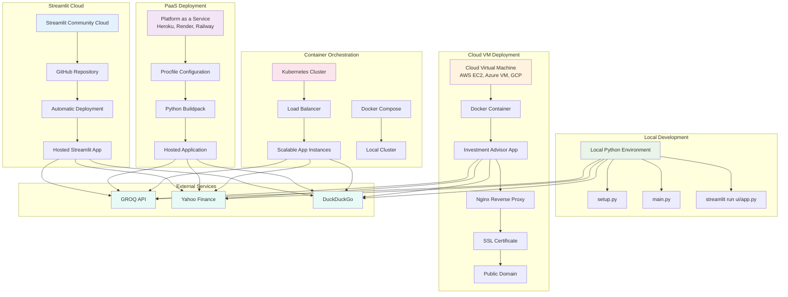

# Deployment Architecture and Options

## Deployment Options

### 1. Local Development
- **Environment**: Python virtual environment with local dependencies
- **Setup**: `python setup.py` for environment initialization
- **Execution**: `python main.py` for CLI or `streamlit run ui/app.py` for web UI
- **Best For**: Development, testing, and personal use

### 2. Streamlit Community Cloud
- **Platform**: Free hosting for Streamlit applications
- **Deployment**: Automatic deployment from GitHub repository
- **Limitations**: Resource constraints, public repository requirement
- **Best For**: Demos, prototypes, and open-source projects

### 3. Cloud VM Deployment
- **Platform**: AWS EC2, Azure VM, Google Cloud Compute Engine
- **Architecture**: Docker containerization with Nginx reverse proxy
- **Features**: Full control, custom domains, SSL certificates
- **Best For**: Production deployments and private applications

### 4. Platform as a Service (PaaS)
- **Platforms**: Heroku, Render, Railway, Google App Engine
- **Configuration**: Procfile and buildpack-based deployment
- **Features**: Easy scaling, managed infrastructure
- **Best For**: Production applications with moderate traffic

### 5. Container Orchestration
- **Platform**: Kubernetes, Docker Swarm, Docker Compose
- **Features**: Auto-scaling, load balancing, high availability
- **Complexity**: Higher setup complexity but maximum scalability
- **Best For**: Enterprise deployments and high-traffic applications

## Deployment Considerations

### Security
- **API Keys**: Secure storage of GROQ_API_KEY and other credentials
- **Environment Variables**: Proper configuration management
- **SSL/TLS**: HTTPS encryption for web interfaces
- **Access Control**: User authentication and authorization

### Performance
- **Resource Allocation**: CPU, memory, and storage requirements
- **Caching**: Redis or in-memory caching for improved performance
- **CDN**: Content delivery network for static assets
- **Monitoring**: Application performance monitoring and logging

### Scalability
- **Horizontal Scaling**: Multiple application instances
- **Load Balancing**: Distribution of requests across instances
- **Database**: Scalable data storage solutions
- **Queue Management**: Background task processing
