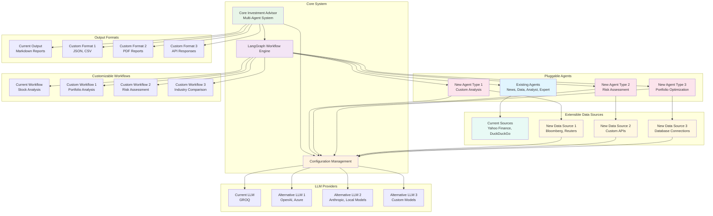

# Extensibility and Customization Architecture

## Extensibility Features

### 1. Pluggable Agent Architecture
- **Easy Addition**: New agents can be added by implementing standard interfaces
- **Specialization**: Agents can focus on specific analysis types (risk, portfolio, industry)
- **Modular Design**: Each agent operates independently with clear inputs/outputs

### 2. Extensible Data Sources
- **Multiple Providers**: Support for various financial data and news sources
- **Custom APIs**: Integration with proprietary or custom data sources
- **Database Support**: Connection to local or remote databases

### 3. Customizable Workflows
- **Workflow Templates**: Pre-defined workflows for common analysis types
- **Custom Logic**: User-defined workflow sequences and agent combinations
- **Conditional Execution**: Dynamic workflow paths based on data or user preferences

### 4. Flexible Output Formats
- **Multiple Formats**: Support for Markdown, JSON, CSV, PDF, and custom formats
- **API Integration**: RESTful API responses for third-party applications
- **Custom Templates**: User-defined report templates and styling

### 5. LLM Provider Flexibility
- **Provider Agnostic**: Easy switching between different LLM services
- **Local Models**: Support for locally hosted models
- **Custom Models**: Integration with proprietary or fine-tuned models

## Implementation Benefits

- **Configuration-Driven**: Most extensions require only configuration changes
- **Plugin System**: New capabilities can be added without core system changes
- **Standard Interfaces**: Consistent APIs for all extensible components
- **Backward Compatibility**: Extensions don't break existing functionality
