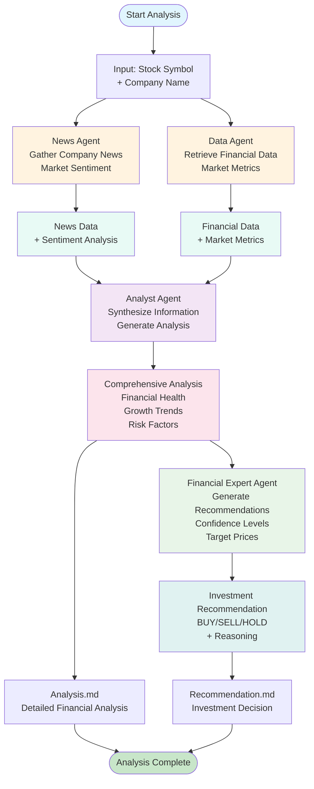

# LangGraph Workflow Orchestration Diagram

## Workflow Description

### Phase 1: Data Collection
- **News Agent**: Searches for company-related news, press releases, and market updates
- **Data Agent**: Retrieves financial statements, market data, and performance metrics

### Phase 2: Information Synthesis
- **Analyst Agent**: Combines news and financial data to create comprehensive analysis
- **Output**: Financial health assessment, growth trends, and risk factors

### Phase 3: Recommendation Generation
- **Financial Expert Agent**: Processes analysis to generate investment recommendations
- **Output**: BUY/SELL/HOLD decision with confidence levels and target prices

### Phase 4: Report Generation
- **Analysis.md**: Detailed financial and contextual analysis report
- **Recommendation.md**: Investment recommendation with reasoning and strategy

## Key Features

- **Parallel Processing**: News and Data agents work simultaneously
- **Sequential Analysis**: Analyst and Expert agents process in sequence
- **Structured Output**: Consistent Markdown report generation
- **Data Flow**: Clear information passing between agents
