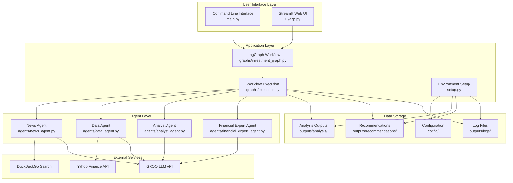

# System Architecture Diagram

## Layer Descriptions

### User Interface Layer
- **CLI**: Command-line interface for direct system interaction
- **Web UI**: Streamlit-based web interface for browser access

### Application Layer
- **Orchestrator**: LangGraph workflow management and agent coordination
- **Executor**: Workflow execution engine and output generation
- **Setup**: Environment initialization and dependency management

### Agent Layer
- **News Agent**: News gathering and sentiment analysis
- **Data Agent**: Financial data retrieval and processing
- **Analyst Agent**: Information synthesis and analysis
- **Financial Expert Agent**: Investment recommendations

### External Services
- **GROQ**: Large Language Model API for AI processing
- **Yahoo Finance**: Financial data and market information
- **DuckDuckGo**: News search and company information

### Data Storage
- **Analysis**: Generated analysis reports in Markdown format
- **Recommendations**: Investment recommendation reports
- **Logs**: System execution logs and debugging information
- **Config**: System configuration and settings
